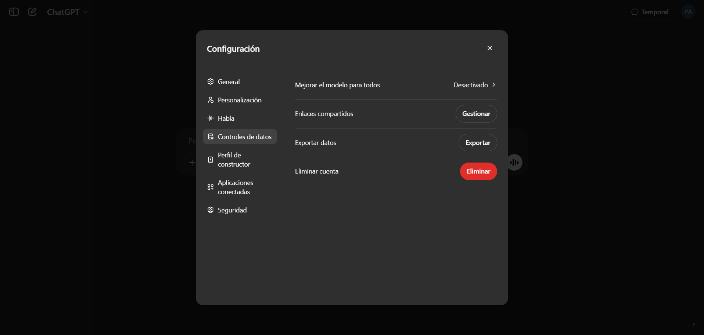
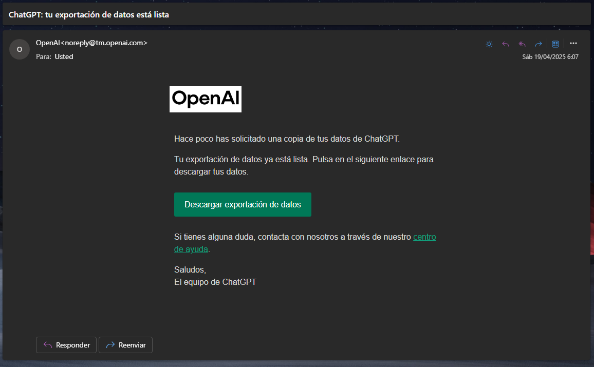

# ChatGPT Walker

Transforma las conversaciones de ChatGPT en archivos Markdown estructurados por fecha y con un formato claro y legible, optimizados para su importación en [Obsidian](https://obsidian.md/).

## Instrucciones de uso

### 1. Exportar tus conversaciones de ChatGPT

1. Ve a [ChatGPT Settings &gt; Data Controls](https://chatgpt.com/#settings/DataControls)
2. Haz clic en "Export data":



3. Recibirás un correo electrónico de OpenAI con el enlace de descarga
4. Descarga y descomprime el archivo:



### 2. Preparar el proyecto (IMPORTANTE)

1. Clona o descarga este repositorio
2. Arrastra el archivo `conversations.json` que descargaste al directorio del proyecto `chatgpt-walker`, de modo que la estructura quede así:

```
chatgpt-walker/
├── conversations.json (debes añadir este fichero)
├── walker.py (debes correr este script)
├── README.md
├── LICENSE
├── export_conversations.PNG
├── download_conversations.PNG
```

### 3. Ejecutar el script

El script creará:

- Una carpeta `output` con subcarpetas organizadas por año, mes y nombre en español (ejemplo: `2024_04_abril`)
- Archivos Markdown para cada conversación, manteniendo:
  - Títulos originales (incluyendo tildes y ñ)
  - Formato de mensajes con emojis para mejor legibilidad
  - Timestamps precisos y la fecha al inicio del nombre del archivo para orden cronológico
- Un archivo `pruned.json` con un resumen de todas las conversaciones

Cada archivo Markdown contiene:

- Título de la conversación
- Mensajes formateados con:
  - Preguntas del Usuario (🙍‍♂️ Usuario:)
  - Respuestas de ChatGPT (🤖 ChatGPT:)

### 4. Importar a Obsidian

Para importar las conversaciones a tu bóveda de Obsidian:

1. Abre tu bóveda de Obsidian
2. Copia todo el contenido de la carpeta `output` (excepto `pruned.json`)
3. Pégalo en tu bóveda de Obsidian
   - Puedes crear una carpeta específica como "ChatGPT" para mantener todo organizado
   - La estructura de carpetas por año y mes se mantendrá intacta

Los archivos ya están en formato Markdown compatible con Obsidian, por lo que:

- Los enlaces internos funcionarán automáticamente
- Puedes usar la vista gráfica para ver conexiones
- El formato de código y las imágenes se mostrarán correctamente
- Puedes usar todos los plugins y funcionalidades de Obsidian para hallar insights

## Licencia

<p align="center">
	Repositorio generado por <a href="https://github.com/virtuanista" target="_blank">virtu 🎣</a>
</p>

<p align="center">
	
</p>

<p align="center">
	Copyright © 2025
</p>

<p align="center">
	<a href="/LICENSE"></a>
</p>
